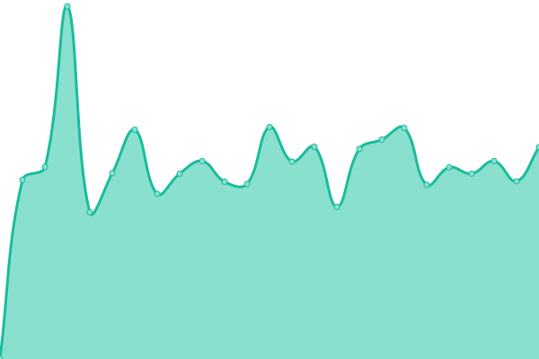
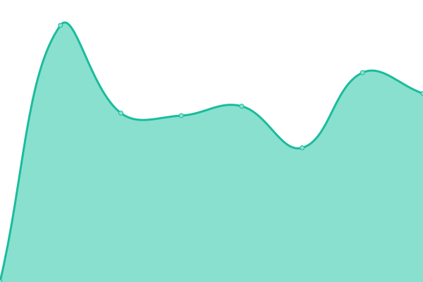

# [📈 Live Status](https://ip00.github.io/upptime): <!--live status--> **🟧 Partial outage**

This repository contains the open-source uptime monitor and status page for [Ivan Pletenac](http://molekula.agency), powered by [Upptime](https://github.com/upptime/upptime).

With [Upptime](https://upptime.js.org), you can get your own unlimited and free uptime monitor and status page, powered entirely by a GitHub repository. We use [Issues](https://github.com/ip00/upptime/issues) as incident reports, [Actions](https://github.com/ip00/upptime/actions) as uptime monitors, and [Pages](https://ip00.github.io/upptime) for the status page.

<!--start: status pages-->
<!-- This summary is generated by Upptime (https://github.com/upptime/upptime) -->
<!-- Do not edit this manually, your changes will be overwritten -->
<!-- prettier-ignore -->
| URL | Status | History | Response Time | Uptime |
| --- | ------ | ------- | ------------- | ------ |
|  [Autotrolej](https://www.autotrolej.hr) | 🟩 Up | [autotrolej.yml](https://github.com/ip00/upptime/commits/HEAD/history/autotrolej.yml) | 

 1337ms
     
 | 

<a href="https://ip00.github.io/upptime/history/autotrolej">98.82%</a>
    

|  [RIJEKA plus](https://rijeka-plus.hr/) | 🟩 Up | [rijeka-plus.yml](https://github.com/ip00/upptime/commits/HEAD/history/rijeka-plus.yml) | 

 2484ms
     
 | 

<a href="https://ip00.github.io/upptime/history/rijeka-plus">98.82%</a>
    

|  [Rasadnik FYI](https://rasadnik.fyi/) | 🟩 Up | [rasadnik-fyi.yml](https://github.com/ip00/upptime/commits/HEAD/history/rasadnik-fyi.yml) | 

 1209ms
     
 | 

<a href="https://ip00.github.io/upptime/history/rasadnik-fyi">100.00%</a>
    

|  [One1.Space](https://one1.space/) | 🟥 Down | [one1-space.yml](https://github.com/ip00/upptime/commits/HEAD/history/one1-space.yml) | 

 513ms
     
 | 

<a href="https://ip00.github.io/upptime/history/one1-space">99.00%</a>
    

|  [Medical Bravo](https://medicalbravo.com/) | 🟩 Up | [medical-bravo.yml](https://github.com/ip00/upptime/commits/HEAD/history/medical-bravo.yml) | 

 1646ms
     
 | 

<a href="https://ip00.github.io/upptime/history/medical-bravo">98.81%</a>
    

|  [RUNE](https://www.ruralnetwork.eu) | 🟩 Up | [rune.yml](https://github.com/ip00/upptime/commits/HEAD/history/rune.yml) | 

 1277ms
     
 | 

<a href="https://ip00.github.io/upptime/history/rune">100.00%</a>
    

<!--end: status pages-->

[**Visit our status website →**](https://ip00.github.io/upptime)

## 📄 License

- Powered by: [Upptime](https://github.com/upptime/upptime)
- Code: [MIT](./LICENSE) © [Ivan Pletenac](http://molekula.agency)
- Data in the `./history` directory: [Open Database License](https://opendatacommons.org/licenses/odbl/1-0/)
